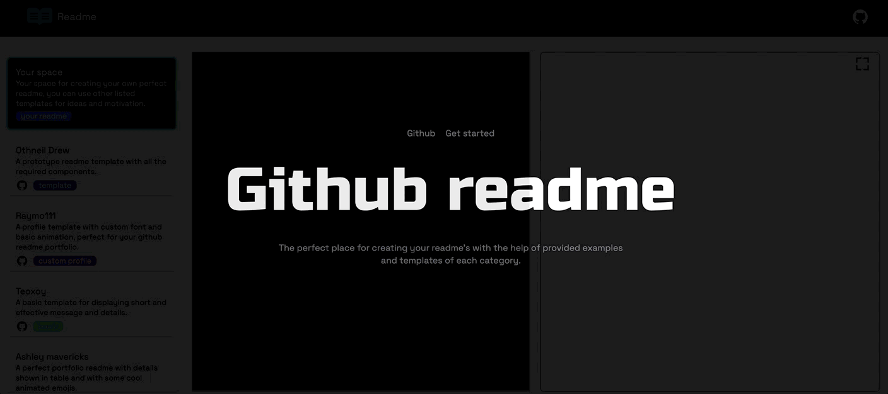

  

<h1 align="center">Github README</h1>

🚀 Your source for awesome README content for profiles, blogs, and instructions.

  <a href="#what-is-a-readme">What is a README?</a> •
  <a href="#how-to-use-this-repository">How to Use This Repository</a> •
  <a href="#contributing">Contributing</a> •
  <a href="#connect-with-us">Connect with Us</a>

## What is a README?

A README (pronounced "read me") is a crucial document that accompanies your GitHub repository. It serves as an introduction and guide to your project, providing essential information to users, contributors, and potential collaborators.

## How to Use This Repository

In this repository, you'll find a variety of README examples and templates for different purposes:

- 💼 **Profile READMEs**: Create a stunning profile README to showcase your skills, projects, and personality.
- ✍️ **Blog READMEs**: Craft informative READMEs for your blog posts to make them more accessible and engaging.
- 📚 **Instructional READMEs**: Share step-by-step instructions for your projects, helping others easily understand and use your code.

Feel free to browse and explore the content. If you find a README that you like, you can simply copy the content and customize it for your own projects.

## Contributing

We encourage you to contribute to this project! If you have an excellent README that you'd like to share with the community or if you want to improve existing READMEs, follow these steps:

* 🍴 Connect me on [Twitter](https://twitter.com/rvikunwar) or send me your read content on [Email](mailto:ravikunwar737@gmail.com).
* 🌟 Or If you want to contribute to code then, Clone the repo and then create a new branch with a descriptive name (e.g., 'feature/add-new-readme').
* 📝 Add your changes and then 
* 📦 Commit your changes with meaningful commit messages.
* 🚀 Push your changes to your forked repository.
* 🔄 Create a pull request (PR) to submit your contribution.
* 🕵️‍♀️ We will review your PR, provide feedback if necessary, and merge it into the main repository once it's ready.

Your contributions will help make this project a valuable resource for other developers.

## Connect with Us

Have questions, suggestions, or just want to chat? Connect with us:

- 📧 [Email](mailto:ravikunwar737@gmail.com)
- 🐦 [Twitter](https://twitter.com/rvikunwar)

Let's collaborate and make READMEs even better!

Happy README-ing! 🚀

